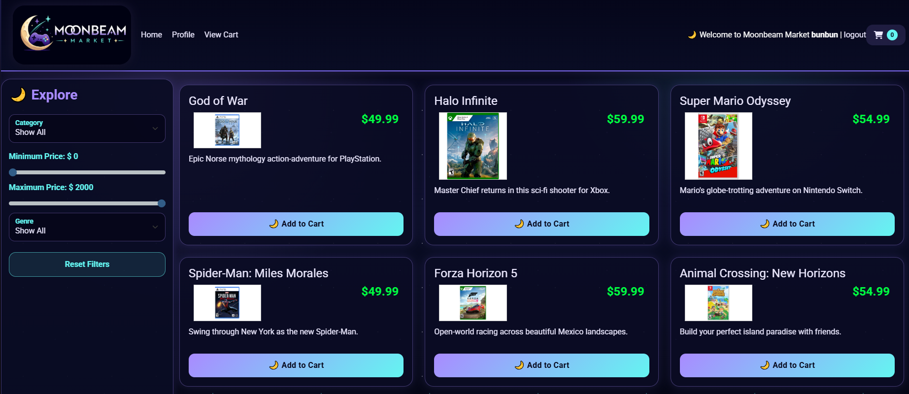
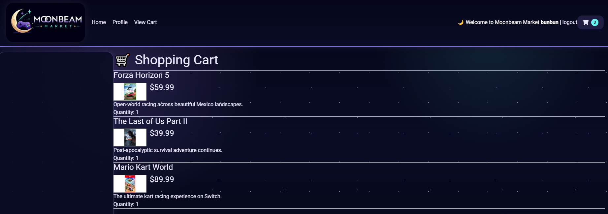
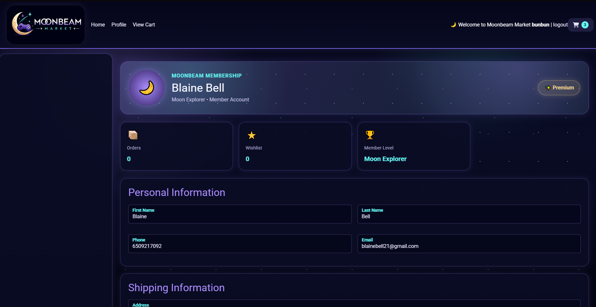
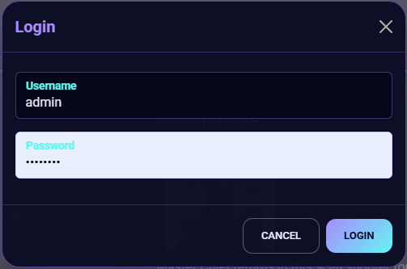
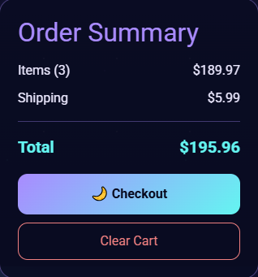
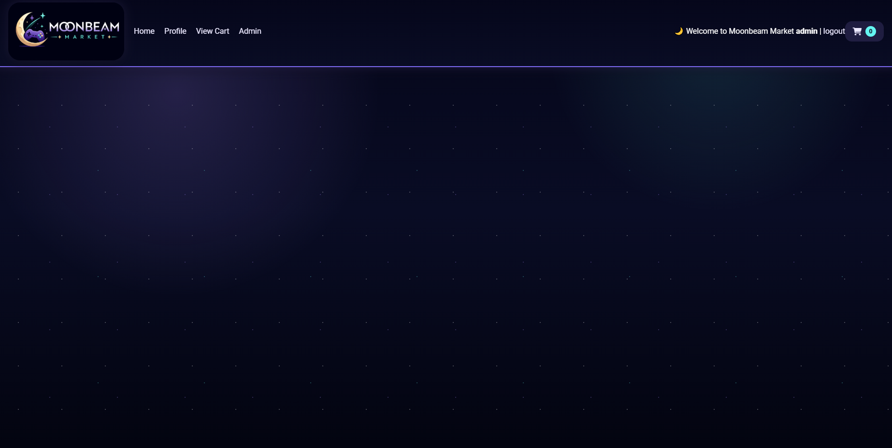

╔══════════════════════════════════════════════╗

           🌙 MOONBEAM MARKET

       Games • Gear • Digital Treasures

      Browse the cosmos for your next adventure.

╚══════════════════════════════════════════════╝

<p align="center">


### *Games • Gear • Digital Treasures*

*A celestial-themed full-stack video game storefront built with Java, Spring Boot, MySQL, and JavaScript.*

</p>

---

## ✨ About The Project

Moonbeam Market is a full-stack e-commerce application inspired by modern digital game storefronts. Originally built from a classroom web store project, it has been extensively redesigned with custom branding, a completely refreshed user interface, additional backend functionality, and new features to create a more polished user experience.

The goal of this project was not only to build a functional REST API, but also to explore full-stack application architecture, authentication, shopping cart management, checkout workflows, and frontend design.

---

## 📸 Screenshots

| Home                      | Shopping Cart             |
| ------------------------- | ------------------------- |
|  |  |

| Profile                      | Login                      |
| ---------------------------- | -------------------------- |
|  |  |

| Checkout                      | Admin Dashboard *(Coming Soon)* |
| ----------------------------- |---------------------------------|
|  |               |

---

# ✨ Features

## 🛍 Customer Features

* Browse products by category
* Product filtering
* Shopping cart
* Update cart quantities
* Secure checkout
* Receipt generation
* Customer profile management
* JWT Authentication
* Responsive UI
* Animated celestial theme

---

## 👑 Admin Features *(In Progress)*

* Product Management
* Category Management
* Inventory Updates
* Admin Dashboard
* Order Management

---

## 🎨 UI Improvements

Moonbeam Market has been completely redesigned with a custom visual identity including:

* 🌙 Moonbeam branding
* ✨ Animated starfield background
* 💜 Custom purple & cyan color palette
* 🎮 Modern product cards
* 🛒 Redesigned shopping cart
* 👤 Premium profile page
* 🌌 Glassmorphism inspired interface
* 📱 Responsive layout

---

# 🛠 Tech Stack

## Backend

* Java 17
* Spring Boot
* Spring Security
* JWT Authentication
* Spring Data JPA
* Hibernate
* MySQL
* Maven

---

## Frontend

* HTML5
* CSS3
* JavaScript
* Axios
* Bootstrap

---

## Development Tools

* IntelliJ IDEA
* MySQL Workbench
* Git
* GitHub
* Insomnia

---

# 🏗 Architecture

```
Frontend (HTML / CSS / JavaScript)

            │

            ▼

REST Controllers

            │

            ▼

Service Layer

            │

            ▼

Repository Layer

            │

            ▼

MySQL Database
```

---

# 🔐 Authentication

Moonbeam Market uses JSON Web Tokens (JWT) to authenticate users.

Features include:

* Secure login
* Role-based authorization
* Customer accounts
* Administrator accounts
* Protected API endpoints

---

# 🗃 Database

Current entities include:

* Users
* Profiles
* Categories
* Products
* Shopping Cart
* Orders
* Order Items

---

# 🚀 Future Improvements

Planned features include:

* ⭐ Wishlist
* 🎮 Featured games section
* 📝 Customer reviews
* 📦 Order history
* 👤 Avatar uploads
* 📧 Email confirmation
* 📊 Sales analytics
* 🛠 Complete admin dashboard
* 🐳 Docker deployment

---

# 📚 What I Learned

Building Moonbeam Market strengthened my understanding of:

* RESTful API development
* Spring Boot architecture
* Layered application design
* Spring Security & JWT Authentication
* Entity relationships with JPA/Hibernate
* BigDecimal for financial calculations
* Shopping cart & checkout workflows
* Responsive frontend development
* UI/UX design principles
* Full-stack debugging and troubleshooting

---

# 🚀 Getting Started

Clone the repository

```bash
git clone https://github.com/BlaineBell21/MoonBeamMarketAPI.git
git clone https://github.com/BlaineBell21/MoonBeamMarket.git 
```

Configure MySQL

```
application.properties
```

Run the Spring Boot application

```
localhost:8080
```

Open the frontend

```
index.html
```

Login

Browse Moonbeam Market!

---

# 🌙 Project Status

🚧 Active Development

Moonbeam Market continues to evolve with new features, UI improvements, and administrative functionality.

---

<p align="center">

### Thanks for visiting Moonbeam Market! 🌙✨

</p>
